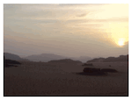

# Sass Cubic Bézier Bounding Box

This is a Sass function to calculate the bounding box of a cubic bézier. I created because I was using an easing function to zoom into an image on hover, but the image first zooms out bit. I needed to add an initial scale on the image so the initial zoom out wouldn’t ever cause the image to become smaller than its container.

The calculations come from [this JSFiddle](https://jsfiddle.net/SalixAlba/QQnvm/4/) by [Salix alba](http://stackoverflow.com/a/24814530/760389).

Here is a GIF of it in use:



Here’s the Sass that produced the effect:

```scss
@import 'cbbb';

$easing-control-points: 1, -0.6, 1, 1;

$final-scale: 10;

$min-max-y: -cbbb-min-max-y-from-control-list($easing-control-points);
$min-y: nth($min-max-y, 1);

$initial-scale: 1 - ($final-scale - 1)*$min-y;

.zoom-container {
  overflow: hidden;
  position: relative;

  img {
    transform: scale($initial-scale);
    transition: all 1s linear;
    transition-delay: 0.5s;
  }

  &:hover {
    img {
      transform: scale($final-scale);
      transition: all 3s cubic-bezier($easing-control-points);
    }
  }
}
```

## Tests

This is tested with [True](https://github.com/oddbird/true).

```bash
npm install
npm test
```